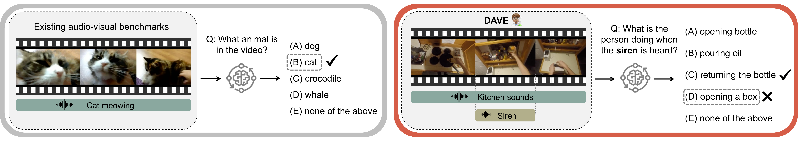

# DAVE: Diagnostic Benchmark for Audio-Visual Evaluation



This repository contains the official inference code for **[DAVE: Diagnostic Benchmark for Audio-Visual Evaluation](https://arxiv.org/abs/2503.09321)**. Use this code to evaluate your audio-visual models on the [DAVE dataset](https://huggingface.co/datasets/gorjanradevski/dave).

---

## 🧩 Overview

DAVE is a diagnostic benchmark that tests audio-visual models by ensuring both modalities (audio and video) are required for successful inference. This repository provides tools to:

- Load and iterate over the dataset
- Construct multimodal prompts
- Run inference with Gemini/OpenAI or your own models
- Evaluate predictions against ground truth

---

## 📦 Installation

```bash
git clone https://github.com/gorjanradevski/dave.git
cd dave
pip install torch datasets google-generativeai openai
```

In case you want to regenerate the dataset from scratch, you will also need to install:

```bash
pip install moviepy ffmpeg-python
```
---

## 📂 Dataset Setup

You can load the dataset via Hugging Face:

```python
from datasets import load_dataset

# split="epic" or split="ego4d"
dataset = load_dataset("gorjanradevski/dave", split="epic", trust_remote_code=True)
```

---

## 🚀 Inference with Gemini/OpenAI Models

1. **Set your API keys:**

```bash
export OPENAI_API_KEY="..."
export GOOGLE_API_KEY="..."
```

2. **Upload the dataset to Google for Gemini-based inference:**

```bash
python src/upload_dataset_gemini.py --split epic --output_path data/epic_gemini_mapping.json
```

3. **Run inference using Gemini:**

```bash
python src/inference.py --split epic \
  --google_id_mapping_path data/epic_gemini_mapping.json \
  --model_names gemini-1.5-flash-latest \
  --prompt_types multimodal
```

This will generate results for the `epic` split across DAVE's three diagnostic tasks: **multimodal synchronization**, **sound absence detection**, and **sound discrimination**.

---

## 🧪 Inference with Your Own Model

```python
import random
sample = random.choice(dataset)

# Access necessary fields
audio_class = sample["audio_class"]
options = sample["raw_choices_multimodal"]
video_path = sample["video_with_overlayed_audio_path"]
ground_truth = options[sample["overlayed_event_index"]]

# Prompt for the model
prompt = f"""What is the person in the video doing when {audio_class} is heard? Choose one:
(A) {options[0]}
(B) {options[1]}
(C) {options[2]}
(D) {options[3]}"""

# Run your model
# prediction = your_model.predict(video_path, prompt)
```
---

## 🐍 Inference with Open-Source Models

To run inference using open-source audio-visual models such as **Video-LLaMA**, **PandaGPT**, or **Video-SALMONN**, follow the setup instructions provided in their respective repositories:

* [Video-LLaMA2](https://github.com/DAMO-NLP-SG/VideoLLaMA2)
* [PandaGPT](https://github.com/yxuansu/PandaGPT)
* [Video-SALMONN](https://github.com/bytedance/SALMONN/blob/main/video_salmonn)

Once set up, place each model inside the `src/external/` directory using the following structure:

```bash
src/external/video_llama/
src/external/pandagpt/
src/external/video_salmonn/
```

---

## 📄 Citation

If you use this benchmark or codebase, please cite:

```bibtex
@article{radevski2025dave,
  title={DAVE: Diagnostic benchmark for Audio Visual Evaluation},
  author={Radevski, Gorjan and Popordanoska, Teodora and Blaschko, Matthew B and Tuytelaars, Tinne},
  journal={arXiv preprint arXiv:2503.09321},
  year={2025}
}
```

---

## 📫 Contact

For questions, open an issue or contact: `firstname.lastname@kuleuven.be`