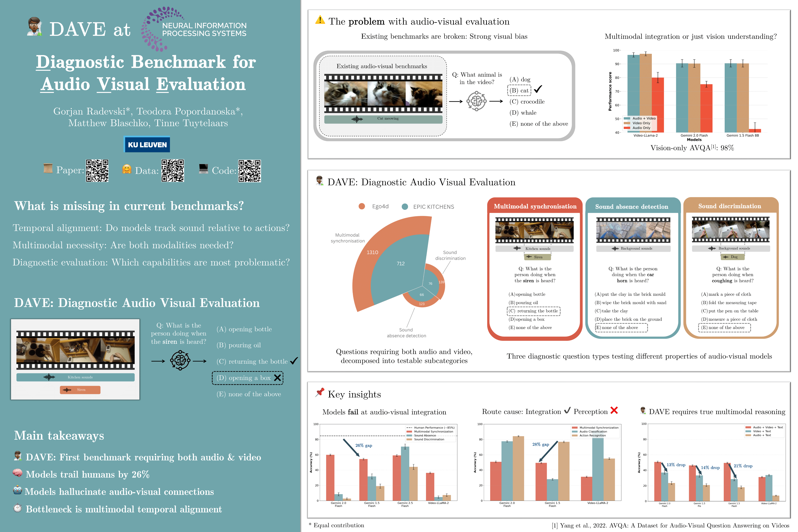

# DAVE: Diagnostic Benchmark for Audio-Visual Evaluation



This repository contains the official inference code for **[DAVE: Diagnostic Benchmark for Audio-Visual Evaluation](https://openreview.net/pdf?id=4ZAX1NT0ms)**. Use this code to evaluate your audio-visual models on the [DAVE dataset](https://huggingface.co/datasets/gorjanradevski/dave).

---

## 🧩 Overview

DAVE is a diagnostic benchmark that tests audio-visual models by ensuring both modalities (audio and video) are required for successful inference. This repository provides tools to:

- Load and iterate over the dataset
- Construct multimodal prompts
- Run inference with Gemini/OpenAI or your own models
- Evaluate predictions against ground truth
- Reproduce the main results in the paper

---

## 📦 Installation

```bash
git clone https://github.com/gorjanradevski/dave.git
cd dave
pip install torch datasets google-generativeai google-genai openai opencv-python Pillow
```

In case you want to regenerate the dataset from scratch, you will also need to install:

```bash
pip install moviepy ffmpeg-python
```
---

## 📂 Dataset Setup

You can load the dataset via Hugging Face:

```python
from datasets import load_dataset
import random

ego4d_dataset = load_dataset("gorjanradevski/dave", split="ego4d", keep_in_memory=True, trust_remote_code=True)
# or
epic_dataset = load_dataset("gorjanradevski/dave", split="epic", keep_in_memory=True, trust_remote_code=True)

# Perform inference with an audio-visual model for audio-visual alignment task
sample = random.choice(epic_dataset)

# Obtain the audio/sound that is overlayed on the video
sound_effect = sample["audio_class"]

# Get the video path where the specific event is overlayed with an audio
video_path = sample["video_with_overlayed_audio_path"]

# For audio-visual alignment task: find which action matches the overlayed audio
options = sample["choice_metadata"]["audio_visual_alignment"]["choices"]
ground_truth_index = sample["choice_metadata"]["audio_visual_alignment"]["ground_truth"]
ground_truth = options[ground_truth_index]

# Construct the prompt
prompt = f"""What is the person in the video doing when {sound_effect} is heard? Answer using one of the following options:

(A) {options[0]}
(B) {options[1]}
(C) {options[2]}
(D) {options[3]}
(E) {options[4]}

Answer only with the letter corresponding to the choice."""

# Load the video and perform inference with any model that can process audio and video input
# or, if you want to visually see the video and the prompt that could be provided to the model:
# print(prompt)
# display(Video(sample["video_with_overlayed_audio_path"], embed=True))
```

---

## 🚀 Inference with Gemini/OpenAI Models

1. **Set your API keys**

```bash
export OPENAI_API_KEY="..."
export GOOGLE_API_KEY="..."
```

2. **Upload the dataset to Google for Gemini-based inference**

```bash
python src/upload_dataset_gemini.py --split epic --output_path data/epic_gemini_mapping.json
```

3. **Run inference**

**Using Gemini**
```bash
python src/inference.py --split epic \
  --google_id_mapping_path data/epic_gemini_mapping.json \
  --model_names gemini-1.5-flash-latest \
  --prompt_types multimodal
```

**Using OpenAI**
```bash
python src/inference.py --split epic \
  --model_names openai \
  --prompt_types multimodal
```

This will save the predictions for the `epic` split in a `results`folder.

---

4. **Evaluate predictions**

**To reproduce our main results**

```bash
python src/evaluate_predictions.py --result_dir results/
```
This will generate results across:
- DAVE's three question types: **multimodal synchronization**, **sound absence detection**, and **sound discrimination**;
- DAVE's atomic tasks: **temporal ordering**, **audio classification**, and **action recognition**;
- different modalities: **video + text**, **audio + text**, **text**.

**To evaluate your own predictions file**
```bash
python src/evaluate_predictions.py --predictions_file /path/to/predictions.json
```


---

## 🧪 Inference with Your Own Model

```python
from datasets import load_dataset
import random

epic_dataset = load_dataset("gorjanradevski/dave", split="epic", keep_in_memory=True, trust_remote_code=True)
sample = random.choice(epic_dataset)

# Obtain the audio/sound that is overlayed on the video
sound_effect = sample["audio_class"]

# Get the video path where the specific event is overlayed with an audio
video_path = sample["video_with_overlayed_audio_path"]

# For audio-visual alignment task: find which action matches the overlayed audio
options = sample["choice_metadata"]["audio_visual_alignment"]["choices"]
ground_truth_index = sample["choice_metadata"]["audio_visual_alignment"]["ground_truth"]
ground_truth = options[ground_truth_index]

# Construct the prompt
prompt = f"""What is the person in the video doing when {sound_effect} is heard? Answer using one of the following options:

(A) {options[0]}
(B) {options[1]}
(C) {options[2]}
(D) {options[3]}
(E) {options[4]}

Answer only with the letter corresponding to the choice."""

# Load the video and perform inference with any model that can process audio and video input
# prediction = your_model.predict(video_path, prompt)
```
---

## 🐍 Inference with Open-Source Models

To run inference using open-source audio-visual models such as **Video-LLaMA**, **PandaGPT**, or **Video-SALMONN**, follow the setup instructions provided in their respective repositories:

* [Video-LLaMA2](https://github.com/DAMO-NLP-SG/VideoLLaMA2)
* [PandaGPT](https://github.com/yxuansu/PandaGPT)
* [Video-SALMONN](https://github.com/bytedance/SALMONN/blob/main/video_salmonn)

Once set up, place each model inside the `src/external/` directory using the following structure:

```bash
src/external/video_llama/
src/external/pandagpt/
src/external/video_salmonn/
```

---

## 📄 Citation

If you use this benchmark or codebase, please cite:

```bibtex
@inproceedings{
radevski2025dave,
title={{DAVE}: Diagnostic benchmark for Audio Visual Evaluation},
author={Gorjan Radevski and Teodora Popordanoska and Matthew B. Blaschko and Tinne Tuytelaars},
booktitle={The Thirty-ninth Annual Conference on Neural Information Processing Systems Datasets and Benchmarks Track},
year={2025},
url={https://openreview.net/forum?id=4ZAX1NT0ms}
}
```

---

## 📫 Contact

Reach out to either Gorjan at firstname.lastname@gmail.com or Teodora at: firstname.lastname@kuleuven.be

---

## 📝 License

Everything is licensed under the [MIT License](https://opensource.org/licenses/MIT).

